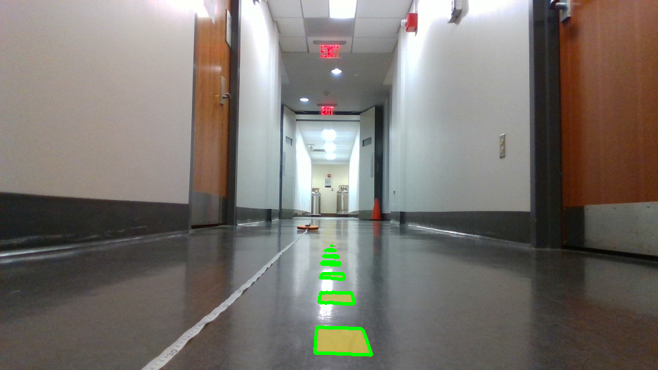
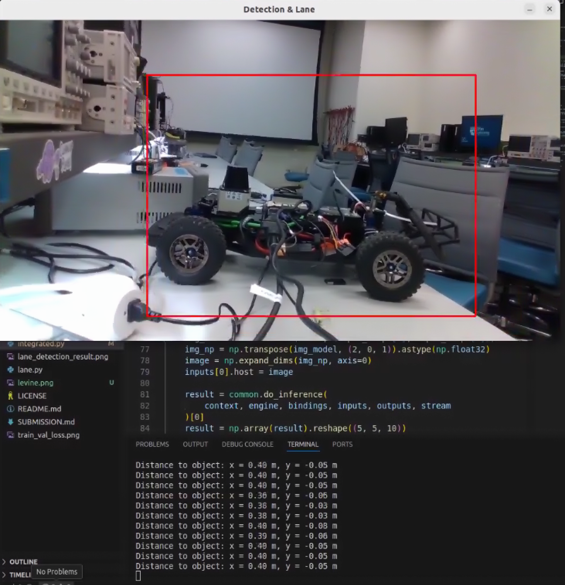
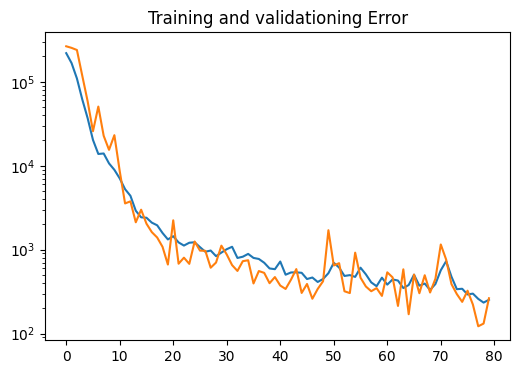

# Lab 8: Vision Lab

## The x, y distance of the unknown cones?
Estimated distance to cone:  (0.6169621490500067 m, -0.13519889733487275 m)

## Lane Detection Result Image

## Integrated Object Detection + Distance Calculation Result Image

## Nerual Network Training & Testing Loss Plot

## Is FP16 faster? Why?
FP16 inference time (ms):  1.43 ms

FP32 inference time (ms):  2.15 ms

You should time only the inference part and average out at least 100 inference cycles.

FP16 is faster because it uses less memory since it is only using 16 bits (instead of 32 bits) to store numbers. With less data to process, it runs faster. 
